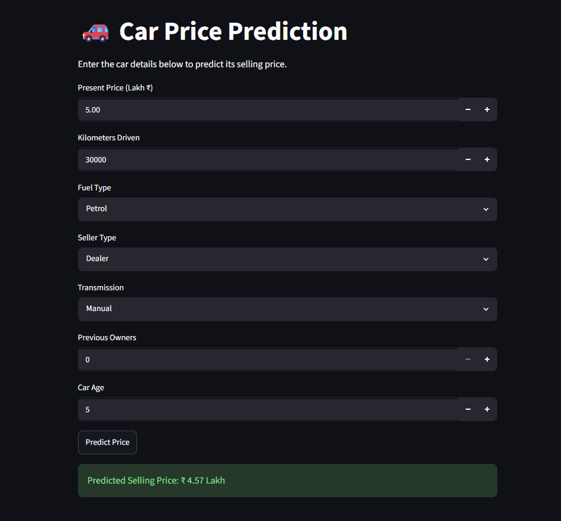

# 🚗 Car Price Prediction using Polynomial Regression

## 📌 Project Overview

This project predicts the selling price of used cars using **Polynomial Regression**. The complete machine learning workflow includes data preprocessing, feature engineering, model training, evaluation, hyperparameter tuning, and deployment with a Streamlit web application.

---

## 🚀 Features

- Data Cleaning
- Exploratory Data Analysis (EDA)
- Feature Engineering
- Linear Regression Baseline
- Polynomial Regression
- Hyperparameter Tuning (GridSearchCV)
- Cross Validation
- Model Evaluation
- Save & Load Model using Joblib
- Prediction Script
- Streamlit Web Application

---

## 📂 Project Structure

```text
car-price-prediction-polynomial-regression/
│
├── data/
├── images/
├── models/
├── src/
├── app.py
├── predict.py
├── requirements.txt
└── README.md
```

---

## 🛠 Technologies Used

- Python
- Pandas
- NumPy
- Matplotlib
- Scikit-learn
- Joblib
- Streamlit

---

## 📊 Model Performance

| Model | R² Score |
|--------|---------:|
| Linear Regression | 0.xx |
| Polynomial Regression | 0.xx |

> Replace the values above with your actual results.

---

## ▶️ Installation

```bash
git clone https://github.com/YOUR_USERNAME/car-price-prediction-polynomial-regression.git

cd car-price-prediction-polynomial-regression

pip install -r requirements.txt
```

---

## ▶️ Run the Web App

```bash
streamlit run app.py
```

---

## 📈 Future Improvements

- Try Random Forest Regressor
- Try XGBoost
- Deploy on Streamlit Community Cloud
- Build a REST API with Flask/FastAPI

---

## 👨‍💻 Author

Hardik Panchal


